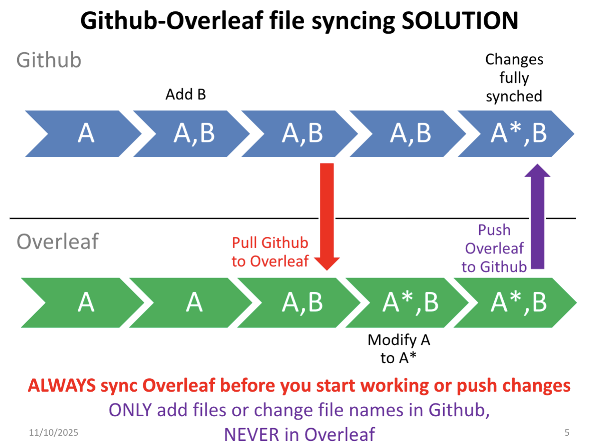

# GitHub {#github}

## Collaboration & Documentation on Github

**Using comments/notifications/commits for collaboration**

- In general, you have to “mention” (@username) someone for them to get a notification
- You can mention individuals or a whole team
- If you edit a comment, a notification isn’t usually sent
  - When you make a change in response to someone’s comment, mention people (@username) who need to know in a new comment
  - Use “blame” feature to figure out where to leave a comment on a file
  - Use detailed commit messages so your teammates know what you’ve accomplished
- Also make sure to report it in your project log (linking to output whenever possible)
  - Use preview before committing so you have fewer commits (avoids formatting errors, obvious mistakes)

It's going to work best to have your work product in an .md file, .do file, discussion or issue

- Then you can just link to each piece from your documentation
- Your log is your only documentation for now
- Soon, we’ll start comprehensive documentation on Overleaf (LaTeX)
  - A Google doc or similar is okay for early work as long as you link to it your documentation and the link is open access
- everything will be formalized into Overleaf soon

## GitHub Desktop

To create a folder to hold papers for your lit review, either

1. Create the file using the Github UI (“user interface”— the web interface we’ve been using). Two ways to do it are described [here](https://www.warp.dev/terminus/how-to-create-folder-in-github)
2. Download Github desktop and use that interface
  - (IMPORTANT: Do NOT just keep clicking if something doesn’t work—ask for help)

Instructions are here to download Github desktop

- Click File, Clone Repository and enter URL of your repo
- Open Windows Explorer (window + E), navigate to “Local path”
- Create a folder called “Literature” with at least one paper in it in the local path
- commit it in Github desktop
- Click “Push origin” at top right
- Look at new commit and new folder on Github UI (website)

Note: it is best to have your GitHub folders within OneDrive.

### Syncing with Overleaf

### Merge conflicts in Github

When you don’t keep Overleaf up to date with Github, you usually end up with a merge conflict.

- Github will create a branch of your repo and you’ll need to resolve the conflict
  - Go to the main page of your repo
  - Click on Branches near the top left
  - Find the branch that was just created, and click on three dots at right, choose “new pull request”
  - Then, follow the directions [here](https://docs.github.com/en/pull-requests/collaborating-with-pull-requests/addressing-merge-conflicts/resolving-a-merge-conflict-on-github)

## Synching to GitHub Desktop Exercise

1. Click on Current repository near the top left of Github Desktop.

- If exercises is in the list, click on it
- If exercises is NOT in the list but you think you cloned the exercises repo last Wednesday (that is, the folder is somewhere on your computer):
  - Click File, click Add local repository, navigate to the folder, click Add repository
  - Don’t give up too easily searching for it. 50% of Github problems come from accidentally downloading the same repo to multiple locations—do everything you can to avoid this
- If you didn’t clone the exercises repo yet:
  - Click File, click Clone Repository, enter URL of your repo, choose where to save it (again, I suggest on OneDrive), click Clone

2. Make sure your “current repository” is set to exercises and synch

- Leave “current branch” set to main
- Look at the box to the right of “current branch”
  - It may say “Pull origin” or “Fetch origin”
  - Regardless, click the button.
  - Wait for Github Desktop to sync your files.
  - If it doesn’t sync the first time, click the button one more time
- Once that third box says “Fetch origin; Last fetched just now”, click “History” toward the left of your screen
  - This shows the same commit history as on the web interface
  - Verify by clicking “View on Github” in the middle of the screen
- Click “Show in Explorer” in the middle of your screen
  - This will show you all the files on your local computer, and they should match what you see on the web interface.

3. Create a new .do file, save to local exercises repo

- Add just one line of text, something like “I’m going to upload this .do file to Github!”
  - Add an asterisk at the beginning of the line; this will make it turn green—it’s a “comment” in the code
- Save the file as yourname.do (e.g., Ryan.do) in the push_to_Github folder in the exercises repo ON YOUR COMPUTER
- In Github Desktop, Changes on the left of the screen should now have a little “1” in a circle, and your file showing up below with a green plus sign next to it

4. Use Github Desktop to upload a file
- In Github desktop:
  - Write a commit message near the bottom left, in the line above “Description.”
  - Make it something specific, like “Add Ryan’s .do file for push-to- Github assignment”
  - You can leave the “Description” box blank—unless you need to add more detail to your commit message
- Click Commit to main
- Click Push origin
- Click View on Github
- Navigate to the Push_to_Github folder
- Verify that your “push” worked by clicking on your file name and viewing its contents.
- If it’s there and has a line of content, you’re done!

## Organizing Data and Files on Project Repo

Start by looking at previous project repos:

  - [Nepobabies](https://github.com/ecn310/course-project-nepobabies)
  - [Accidents](https://github.com/ecn310/course-project-taxes-tariffs/tree/main/Reproducibility_Package)
- Sometimes you feel like something is important to keep for later—that’s fine
- If you won’t need a file again (e.g., .zip file for schain that I asked to be replaced by .dta), delete it
  - You can always go back into an earlier version of the repo to get things back if you get rid of them accidentally
- No need for “versioning” documents -- Github always keeps the old versions

To turn off notifications from a Github repo

- Go to the main page of the repo
- Click "Unwatch" toward the top right
- Choose "Ignore"

**Code Documentation**

Learning objectives (Slides 1-18 of PDF provided on Blackboard):

1. Understand the role the code you write plays in a project, including for reproducibility and team dynamics.
  - The research output is not just a paper or report, but whole process. That means code, data, documentation are just as important as the final text
2. Articulate why you should use the Stata help files and reference manual.
  - Valley of Hubris: your code doesn’t just need to run; it needs to produce what you intend to produce / what you tell others it produces
3. Learn the structure and syntax of Stata help files.
  - Demo (23 pages on merge alone!)
4. Use the three types of comments to effectively document your code

**Types of Documentation**

For your project, you need all of the following:
- “Daily” stream-of-consciousness log of work (you are already doing this!)
- Task documentation
  - Keeps all the information about a task in the same place
  - Usually on an Issue on Github, sometimes Discussion (example [here](https://github.com/kbuzard/labs/issues/51))
- Code (do-files if working in Stata)
  - Must be thoroughly commented
- A master documentation file
  - A master documentation file keeps track of where all the various pieces of your project are (data, literature, notes, code)
    - [Example](https://github.com/ecn310/course-project-accidentsteam/tree/main/Reproducibility%20Package) from a previous project for this course
  - You have started this on data.tex
  - Pieces of this will end up in your master documentation file
  – Master documentation should then be updated anytime anyone in your team creates something new or a major decision is made
  - For now, make sure to keep up with daily log, task documentation on Github issues, and keep updating data.tex
- A master script 
- The research report 
